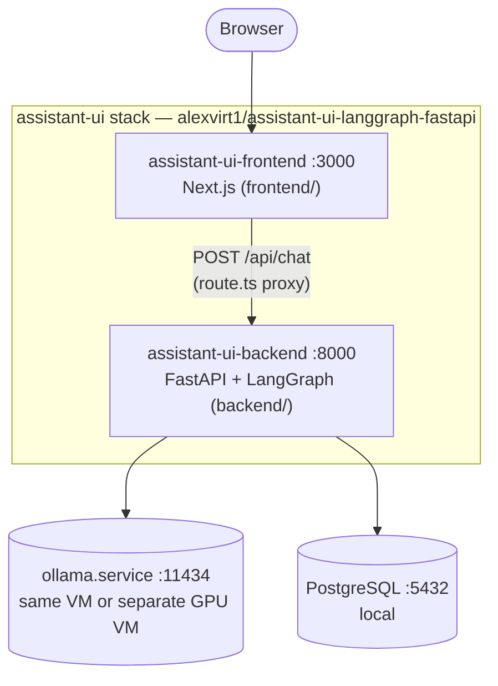

# AI Homelab Runbook

Rebuild/setup documentation and scripts for the local AI agent stack running
on this host (`ai-2`). Captures the current known-good state as executable
documentation so the stack can be reinstalled or moved to a new host without
re-deriving everything from the chat history in `chat-scripts.md`.

## Architecture



`assistant-ui-backend` and `assistant-ui-frontend` must run on the same
host, since the frontend proxies to the backend at `127.0.0.1:8000`.

> There used to be a second, independent chat backend here
> (`langgraph-fastapi.service`, from `alexvirt1/langgraph-ollama-agent`). It
> was a parallel reimplementation of the same agent with no dependency
> between it and `assistant-ui-backend`, and has been retired from this
> runbook as outdated — this repo now only installs/manages the
> assistant-ui stack.

## Repos and services

| Repo | Deploys to | systemd service | Port |
| --- | --- | --- | --- |
| [alexvirt1/assistant-ui-langgraph-fastapi](https://github.com/alexvirt1/assistant-ui-langgraph-fastapi/) `backend/` | `/opt/ai-agent-lab/assistant-ui-langgraph-fastapi/backend` | `assistant-ui-backend.service` | 8000 |
| same repo, `frontend/` | `/opt/ai-agent-lab/assistant-ui-langgraph-fastapi/frontend` | `assistant-ui-frontend.service` | 3000 |

## Prerequisites

Install/verify these before running anything in `scripts/`:

- Ubuntu with `git`, `curl`, `sudo` access
- Python 3.11+ (`python3 --version`)
- [Poetry](https://python-poetry.org/) (`poetry --version`) — used for the assistant-ui backend
- Node.js 20+ with Corepack enabled (`node --version`, `corepack --version`) — used for the frontend (pnpm via corepack)

Neither PostgreSQL nor Ollama need to be installed by hand — `scripts/install-postgres.sh`
and `scripts/install-ollama.sh` handle those. Check readiness at any time with:

```bash
scripts/check-postgres.sh
```

## Quick start

**1. Get Ollama running somewhere reachable.** This can be this same host or
a separate (typically GPU) VM — the lab default is a dedicated GPU VM at
`192.168.87.160`:

```bash
# on whichever host should serve models:
scripts/install-ollama.sh
```

`deploy-all.sh` below only checks that Ollama is reachable at
`OLLAMA_BASE_URL` (default `http://192.168.87.160:11434`); it never installs
Ollama itself, since that host is frequently not the one running this repo.
If you're running Ollama on this same host, either re-run with
`OLLAMA_LISTEN_HOST=127.0.0.1 scripts/install-ollama.sh` and
`OLLAMA_BASE_URL=http://127.0.0.1:11434 scripts/deploy-all.sh`, or leave the
default `0.0.0.0` binding — it also works for local callers.

**2. On the app host, deploy the rest** (idempotent — safe to re-run):

```bash
cd /opt/ai-agent-lab/agentic-ai-runbook
scripts/deploy-all.sh
```

This installs/verifies Postgres, checks Ollama is reachable, then runs the
two deploy scripts below in sequence, then curls both health endpoints.

## Individual scripts

Run these on their own if you only need to install/update one piece.

```bash
scripts/install-ollama.sh                 # Ollama                        (:11434)
scripts/install-postgres.sh               # PostgreSQL + role/db provisioning
scripts/deploy-assistant-ui-backend.sh    # assistant-ui-backend.service   (:8000)
scripts/deploy-assistant-ui-frontend.sh   # assistant-ui-frontend.service  (:3000)
```

### `install-ollama.sh`

Idempotent Ollama bootstrap, meant to be run directly on whichever host
should serve models (not necessarily the same one running the rest of this
repo):

1. Installs Ollama via its official installer
   (`curl -fsSL https://ollama.com/install.sh | sh`) if the `ollama` binary
   isn't already present.
2. Writes the base `ollama.service` unit.
3. Detects an NVIDIA GPU (`nvidia-smi -L`). If present, writes a drop-in
   (`ollama.service.d/override.conf`) that waits for
   `nvidia-persistenced.service` and the GPU to enumerate before starting,
   and pins `CUDA_VISIBLE_DEVICES=0`. If no GPU is found, writes the same
   drop-in without the GPU-specific bits, so it also works for a CPU-only
   or same-VM setup.
4. Either way, the drop-in sets the lab's known-good tuning:
   `OLLAMA_CONTEXT_LENGTH=8192`, `OLLAMA_NUM_PARALLEL=1`,
   `OLLAMA_MAX_LOADED_MODELS=1`, `OLLAMA_MAX_QUEUE=32`,
   `OLLAMA_FLASH_ATTENTION=1`, `OLLAMA_KV_CACHE_TYPE=q8_0`, and
   `OLLAMA_HOST` (default `0.0.0.0`, so other hosts on the LAN can reach
   it — set `OLLAMA_LISTEN_HOST=127.0.0.1` to keep it local-only).
5. Enables, restarts, and health-checks the service.
6. Prints the `ollama pull <model>` command for the model this stack
   expects (`qwen3:8b` by default) instead of pulling it automatically —
   set `PULL_MODEL=1` to have the script pull it for you.

All values are overridable via env vars of the same name shown above (e.g.
`OLLAMA_CONTEXT_LENGTH=16384 scripts/install-ollama.sh`).

If Ollama ends up on a separate host from the rest of the stack and you use
a firewall, open the port to your lab subnet, e.g.
`sudo ufw allow from 192.168.87.0/24 to any port 11434 proto tcp`.

### `install-postgres.sh`

Idempotent PostgreSQL bootstrap:

1. Installs the `postgresql`/`postgresql-contrib` apt packages if `psql`
   and the `postgresql` systemd unit aren't already present.
2. Enables and starts the `postgresql` service, waits for it to accept
   connections on `127.0.0.1:5432`.
3. Creates the `assistant_ui` / `assistant_ui` role/database that
   `assistant-ui-backend.service` expects, **only if it doesn't already
   exist** (an existing role keeps its existing password — this script
   never resets one).
4. Prints the resulting `DATABASE_URL` value for you to paste into the
   prompt shown by `deploy-assistant-ui-backend.sh` — it does not write it
   to any file itself.

Role/database name are overridable via `ASSISTANT_UI_DB_ROLE`,
`ASSISTANT_UI_DB_NAME`. The password is read from `ASSISTANT_UI_DB_PASSWORD`
if pre-exported, otherwise prompted for interactively (non-echoing) the
first time the role is created.

`deploy-all.sh` runs this automatically; set `SKIP_POSTGRES_INSTALL=1` to
skip it and just verify an existing Postgres instance is up instead (e.g.
if Postgres is managed outside this repo).

### The two `deploy-*.sh` scripts

Each one:

1. Clones the repo on first run; on later runs, fast-forward pulls latest
   `main` (stops and warns instead of clobbering if the checkout has local
   edits).
2. Installs/updates dependencies (shared venv, Poetry in-project venv, or
   pnpm, depending on the service).
3. Creates a `.env` with sane non-secret defaults **only if one doesn't
   already exist** — existing `.env` files are never overwritten.
4. Writes the systemd unit to `/etc/systemd/system/` (requires `sudo`).
5. Reloads systemd, enables and (re)starts the service.
6. Runs a `curl` health check.

You'll be prompted for `sudo` (for the systemd steps) and possibly for a
Postgres connection string (see **Secrets** below).

## Secrets

Nothing in this repo or in `scripts/` contains real credentials.

- `install-postgres.sh` role password — read from `ASSISTANT_UI_DB_PASSWORD`
  if pre-exported, otherwise prompted for interactively (non-echoing).
  Never written to disk by the script itself.
- `assistant-ui-backend` — `DATABASE_URL` is **not** put in the repo or the
  main unit file. It's stored in a systemd drop-in
  (`/etc/systemd/system/assistant-ui-backend.service.d/override.conf`),
  created once via an interactive, non-echoing prompt (or by pre-exporting
  `ASSISTANT_UI_DATABASE_URL` before running the script). Re-running the
  script leaves an existing drop-in untouched.
- Non-secret config (`OLLAMA_BASE_URL`, `OLLAMA_MODEL`, `OLLAMA_NUM_CTX`) is
  filled in with real homelab values since these aren't credentials.

## Security

This stack has no authentication layer — the frontend, backend API, and
Ollama endpoint are all reachable by anyone who can route to their ports.
This is intentional: the framework is designed for single-user use on a
trusted home/lab network, not for multi-tenant or internet-facing
deployment. If you expose any of these services beyond your trusted LAN
(e.g. port-forwarding, a public reverse proxy, or a shared network), put
your own authentication/authorization layer in front of them first.

## Overriding defaults

All scripts read their inputs from environment variables with sensible
defaults, so you can point them at a different host/layout without editing
the scripts:

```bash
ASSISTANT_UI_DIR=/srv/assistant-ui-langgraph-fastapi \
SERVICE_USER=deploy \
scripts/deploy-all.sh
```

See the top of each script for the full list of variables it honors.

## Validating a deploy

```bash
curl -s http://<ollama-host>:11434/api/tags | jq
curl -s http://127.0.0.1:8000/openapi.json | jq '.paths | keys'
curl -I http://127.0.0.1:3000/
```

Then in a browser, open `http://<server-ip>:3000`, ask "What time is it?",
and confirm the tool call in the backend log:

```bash
journalctl -u assistant-ui-backend -n 50 --no-pager | grep 'TOOL EXECUTED'
```

Confirm Postgres persistence (same `thread_id`/browser session across two
messages should recall earlier facts):

```bash
sudo -u postgres psql -d assistant_ui -c \
  "SELECT thread_id, count(*) FROM checkpoints GROUP BY thread_id ORDER BY count(*) DESC;"
```

## Operating the services

```bash
sudo systemctl status  assistant-ui-backend assistant-ui-frontend --no-pager
sudo systemctl restart assistant-ui-backend assistant-ui-frontend
journalctl -u <service-name> -f
```

## Troubleshooting

- **`status=203/EXEC`** in `systemctl status` — the `ExecStart` binary path
  doesn't exist under systemd's environment. Check with
  `command -v <binary>` and compare to the path baked into the unit file.
- **Backend starts but `/api/chat` 404s / no persistence** — `DATABASE_URL`
  drop-in is missing or wrong; check
  `systemctl cat assistant-ui-backend` and `journalctl -u assistant-ui-backend`.
- **Frontend loads but chat fails** — confirm
  `frontend/app/api/chat/route.ts` still points at
  `http://127.0.0.1:8000/api/chat`, and that `assistant-ui-backend` is
  active on the same host.
- **`ollama.service` stuck `activating` on a GPU host** — the
  `ExecStartPre` GPU wait loop (`nvidia-smi -L | grep -q GPU`) never
  succeeds. Check `nvidia-smi` works at all outside systemd, and that the
  NVIDIA driver/`nvidia-persistenced` came up; see
  `journalctl -u ollama -n 80 --no-pager`.
- **Backends can't reach Ollama across the LAN** — confirm `OLLAMA_HOST` on
  the Ollama host is `0.0.0.0` (not `127.0.0.1`), and that its firewall
  allows the app host's IP on port `11434`.
- **Full historical context** for how this stack was built, debugged, and
  every dead end along the way: `chat-scripts.md` in this repo.
